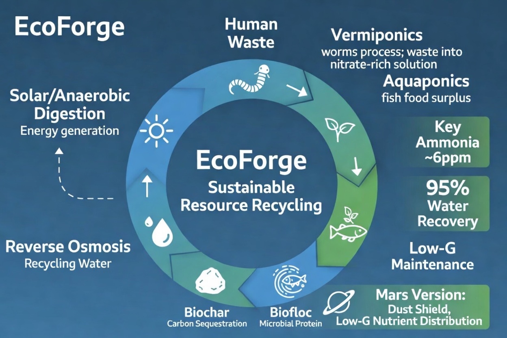
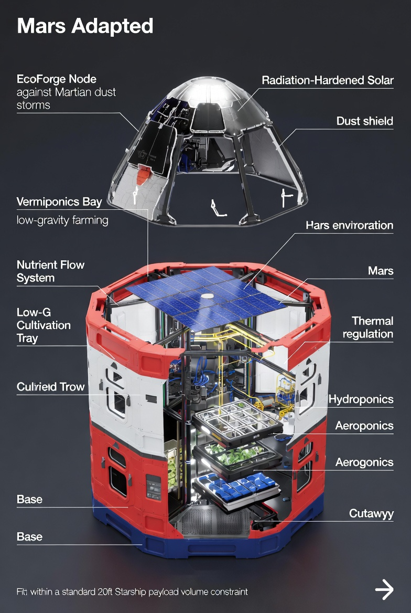

# EcoForge 🌱⚒️🚀🪐

**Open-source AI-optimized closed-loop homestead nodes** (Grok + Optimus + Starship-hardened) for Earth abundance, regenerative recovery, and Mars readiness. Humanity first.

## Quick Start
- **Live API**: /simulate endpoint (vermiponics + RO) → [Swagger link]
- **Full Blueprint**: [Master Report v2](docs/EcoForge-Master-Blueprint-v2.md)
- **First Build**: ~$1–1.15k pilot

## System Overview

## Key Metrics (v3 Supernova)
- RO: 18.8 LMH flux | 4.5–5.8 ppm | 0.55 kWh/m³  
- Vermiponics: NH3 <6 ppm | 95%+ recovery  
- Pilot: 10 residents → 400 lbs/mo surplus

## Transparency Dashboard
Open-source from day 0. Wallet, sensors, and milestones tracked here once live. Hand out, heart wide open. Family ❤️♾️ Forge eternal.

**Current Status**  
- Blueprint v3 Supernova locked (95%+ recovery, <6 ppm, 0.55 kWh/m³).  
- Repo active & public.  
- Physical Cambridge I-70/I-77 node queued.  
- Treasury activation pending X Money rollout.  
- Daily grind: 30–90 min (family first).

**Live Metrics & Transparency** (placeholders — feeds incoming)  
- **Treasury Wallet Balance**: [Coming soon — multisig/on-chain on green] $0.00  
- **Recent Transactions**: [On-chain explorer link placeholder]  
- **System Sensors** (Grok/ESP32): TDS <6 ppm target | Vermi pH 6.8–7.2 | Flow 15–20 LMH | Current: —  
- **BOM Sourcing**: DuPont BW30, Energy Recovery ERD, Atlas sensors — receipts incoming.  
- **Milestones**:  
  - Phase 1: Blueprint & sim lock → COMPLETE ✅  
  - Phase 2: Physical container + first cycle → NEXT (see /docs/Phase2_Checklist.md)  
  - Phase 3: Grok agents + multi-node → queued  
- **Sensor Logging Prototype**: [grok_esp32_logger_stub.py](./src/tools/grok_esp32_logger_stub.py) — simulation running, CSV logs live  
- **BOM Sourcing Tracker**: [BOM_sourcing.md](./docs/BOM_sourcing.md) — items researched & ready for bootstrap orders
- **Master Build Plan & Full Cost Breakdown**: [Master_Build_Plan_And_Cost_Breakdown.md](./docs/Master_Build_Plan_And_Cost_Breakdown.md) — everything funders need (what/how/cost $6,850 pilot)
- **Treasury Activation Template**: [Treasury_Activation_Template.md](./docs/Treasury_Activation_Template.md) — post-ready when wallet greens

**Roadmap Checklists**  
- [Master Blueprint v2](./docs/EcoForge-Master-Blueprint-v2.md)  
- [Phase 2 Build Sequence Checklist](./docs/Phase2_Checklist.md) — added tonight
  
## BOM & Build Guide

## Mars Adaptation

## Scaling Roadmap

## Get Involved
Fork • Build • Fund • Call the API  
Repo status: Visuals live — supernova incoming. ❤️⚒️∞🌍→🪐
echo "# EcoForge-Hub\n\nMQTT-based Grok Central Hub simulator for closed-loop abundance nodes.\n\n## Quick Start\n1. \`pip install paho-mqtt\`\n2. \`python3 grok_hub_simulator.py\`\n\nLogs to \`ecoforge_data_log.csv\`. Auto-alarms on TDS >15 ppm.\n\nForge eternal. ∞ ⚒️🌱💧🪐🚀" > README.md
git add README.md
git commit -m "Add README with setup & vibe"
git push
